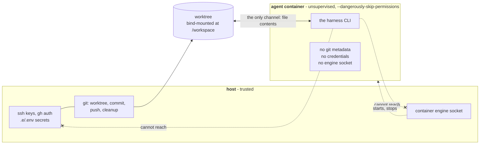

# The host orchestrates git; credentials never enter the agent sandbox

**Status:** Accepted

All git operations for a run: creating the worktree, committing leftover
changes, pushing the branch, and cleanup, run in the host `e` process. The
container only runs the harness against the mounted `/workspace`. This keeps
push credentials (ssh keys, `gh` auth) out of the container, which runs the
agent with `--dangerously-skip-permissions` and is therefore fully
unsupervised.

On a successful run: agent **exit code 0 and commits beyond the base ref**, `e`
pushes the branch to origin. A push failure (no remote, auth, rejected) is
**non-fatal**: the branch is kept locally with a warning, never losing work.

## The trust line

Everything that needs a credential stays left of the boundary. The container
gets a directory of files and nothing else.

On success (exit 0 **and** commits beyond the base ref) the host pushes. A push
failure is non-fatal: the branch is kept locally with a warning, so work is
never lost.

## Considered Options

- **Git inside the container**, rejected: it would require mounting push
  credentials and granting network egress to the unsupervised,
  skip-permissions sandbox, widening the blast radius of a compromised or
  prompt-injected agent.

## Consequences

- Related accepted risk: the container still has **full network egress** (the
  agent must reach its model API), so this trust boundary limits credential
  exposure, not exfiltration in general. Egress hardening is a known, deferred
  gap (ADR-0011).
  _Amended 2026-09:_ ADR-0011 closed this gap; with the local stack present the
  run shares the `e-egress` namespace (DNS sinkhole + iptables, logged).
- The harness's declared secrets are still injected into the container via the
  shared `.e/.env` (the whole file, unfiltered): a deliberate simplicity
  trade-off, cheap to tighten later.
  _Amended 2026-09:_ tightened; `.e/.env` is filtered to the run's declared
  provider and MCP keys (`baseEnvWhitelist` in `planSpawn`/`executeSpawn`,
  issue #24).
