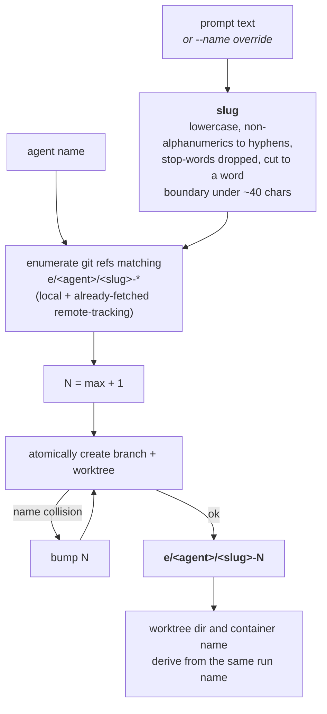

# Run identity and ledger are branch-shaped

**Status:** Accepted

A run is named `e/<agent>/<slug>-N`. The **slug** is derived deterministically
from the prompt (lowercase, non-alphanumerics to hyphens, stop-words dropped,
truncated to a word boundary under ~40 chars); `--name` overrides it. `N` is a
**sequential counter**: `e` enumerates git refs matching `e/<agent>/<slug>-*`
(local and already-fetched remote-tracking refs) and takes the max plus one.
Worktree directory and container name derive from the same run name.

Git branches are the **sole source of truth** for existing runs and the counter:
there is no separate state store. The counter race between concurrent spawns is
closed by atomic branch/worktree creation: on a name collision the creation
fails, and `e` bumps `N` and retries.

## Deriving a run name

Git refs are the **sole** source of truth: there is no `runs.json`, so there is
nothing to keep in sync or recover from corruption. The counter race between
concurrent spawns is closed by the atomicity of branch creation, not by a lock.

## Considered Options

- **A managed index file (`runs.json`)**, rejected for now: a second source of
  truth to keep synced, locked, and recover from corruption. If the
  orchestrator later needs live status/timing/logs, such an index can layer on
  top without changing how identity and counting work.
- **Live `git worktree list`**, rejected: worktrees are dropped after each run,
  so it cannot count historical runs.
