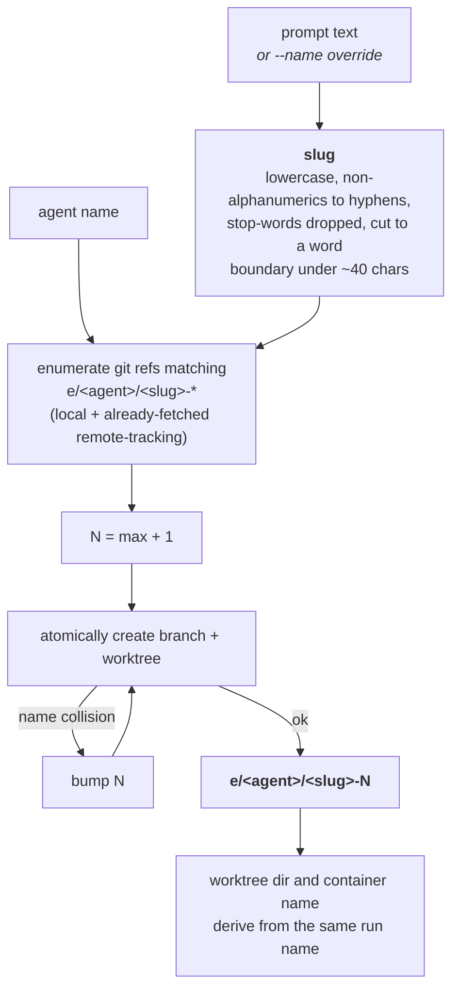

# Run identity and ledger are branch-shaped

**Status:** Accepted

A run is named `e/<agent>/<slug>-N`. The **slug** is derived deterministically
from the prompt (lowercase, non-alphanumerics to hyphens, stop-words dropped,
truncated to a word boundary under ~40 chars); `--name` overrides it. `N` is a
**sequential counter**: `e` enumerates git refs matching `e/<agent>/<slug>-*`
(local and already-fetched remote-tracking refs) and takes the max plus one.
Worktree directory and container name derive from the same run name.

Git branches are the **sole source of truth** for existing runs and the counter:
there is no separate state store. The counter race between concurrent spawns is
closed by atomic branch/worktree creation: on a name collision the creation
fails, and `e` bumps `N` and retries.

## Deriving a run name

```mermaid
flowchart TB
    prompt["prompt text<br/><i>or --name override</i>"] --> slug
    slug["<b>slug</b><br/>lowercase, non-alphanumerics to hyphens,<br/>stop-words dropped, cut to a word<br/>boundary under ~40 chars"]
    agent["agent name"] --> refs
    slug --> refs
    refs["enumerate git refs matching<br/>e/&lt;agent&gt;/&lt;slug&gt;-*<br/>(local + already-fetched remote-tracking)"]
    refs --> n["N = max + 1"]
    n --> create["atomically create branch + worktree"]
    create -->|"name collision"| bump["bump N"] --> create
    create -->|"ok"| named["<b>e/&lt;agent&gt;/&lt;slug&gt;-N</b>"]
    named --> derived["worktree dir and container name<br/>derive from the same run name"]
```

Git refs are the **sole** source of truth: there is no `runs.json`, so there is
nothing to keep in sync or recover from corruption. The counter race between
concurrent spawns is closed by the atomicity of branch creation, not by a lock.

## Several repositories, one namespace

A home Store's runs are cut in several repositories (ADR-0016), but the
worktrees dir is one per host, and the container name and the session
(`.e/runs/sessions/<run name>`, one per Store) are keyed by the run name alone.
So the counter spans the Store's **run namespace** (`runNamespace.ts`, #208):
this repository's refs plus those of every repository the Store's triggers name
(`repo`) or its runs have been cut in (`.e/runs/repos/`, one file per
repository, written by each run before it cuts its branch). One that cannot be
read is skipped. A run name is thereby unique per Store rather than per
repository. Two runs racing for one name are kept apart by the worktree path,
which is host-wide: the host claims it with an exclusive `mkdir` before
`git worktree add`, which would otherwise create the branch before refusing
the path and leave the loser a stray one. The loser bumps `N` like on any
other collision. `GET /api/runs` lists the runs of the whole namespace next to
`serve`'s own, each naming its `repo`.

The namespace record is a list of repositories, not of runs: branches stay the
only source of truth for which runs exist.

Rejected: a repository component in the worktree, container and session names
(every name `runName.ts` derives, and every reader of them, would take a second
key, and the branch alone would no longer name a run), and a per-repository
worktrees subdir (it separates the worktrees and nothing else). The browser
terminal starts runs only in `serve`'s own repository; a run elsewhere comes
from a trigger or from an `e spawn` in that repository.

## Considered Options

- **A managed index file (`runs.json`)**, rejected for now: a second source of
  truth to keep synced, locked, and recover from corruption. If the
  orchestrator later needs live status/timing/logs, such an index can layer on
  top without changing how identity and counting work.
- **Live `git worktree list`**, rejected: worktrees are dropped after each run,
  so it cannot count historical runs.
