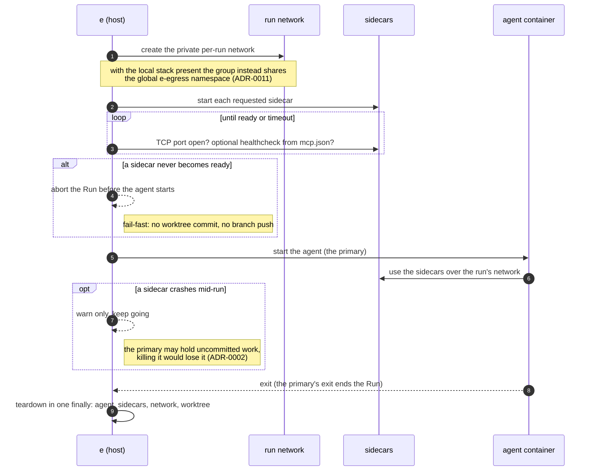

# A Run is a host-orchestrated group of containers on a private network

**Status:** Accepted. _Amended 2026-09:_ with the local stack present, the
agent and its sidecars share the global `e-egress` network namespace
(ADR-0011) instead of a private per-run network; the per-run network remains
the fallback without the stack. _Amended 2026-09-13:_ "host-orchestrated" is
not a licence for a manager class per concern - see **One implementor is not a
seam** below.

Extending ADR-0001 and ADR-0002, a Run is no longer a single container. It is a
**primary agent container** plus zero or more per-run **Sidecars**:
container-transport MCP servers today, a VPN later, on a private per-run
network, all brought up and torn down by the host `e` process. Sidecars are
chosen per-run (`--mcp <name>...`), never baked into the agent.

Lifecycle: create the private network, start sidecars, wait for readiness (TCP
port open within a timeout, plus an optional healthcheck declared in the MCP
server's `mcp.json`), then start the agent. The agent is the primary: its exit
ends the Run.

Failure semantics mirror the patterns already in `runSpawn`:

- A requested sidecar that never reaches readiness **aborts the Run before the
  agent starts**: fail-fast, like the existing not-a-repo / not-initialized
  checks. No worktree commit, no branch push.
- A sidecar that **crashes mid-run is non-fatal**: the agent keeps working and
  the failure is surfaced as a warning, exactly as a failed push is today,
  because the primary may hold uncommitted work and killing it would violate
  the never-lose-work line of ADR-0002.

Teardown is group-wide in the same `finally` that already drops the worktree:
agent, sidecars, network, worktree.

## Group lifecycle

## Considered Options

- **Single container, MCP servers as in-image processes**, rejected:
  re-explodes the image matrix (agent x mcp-set), couples lifecycles, and
  cannot host a VPN container.
- **A general compose/orchestration engine (Compose, Kubernetes)**, deferred:
  the existing thin Runtime port plus a runtime network primitive and a tracked
  list of container names is enough; a compose engine is a heavier commitment
  not needed yet.

## Consequences

- The Runtime port grows from "run one container" to "bring up a group, wait on
  the primary, tear all down".
- Container-transport MCP servers must speak **streamable HTTP**: stdio cannot
  cross a container boundary, and SSE is deprecated in Claude Code and
  unsupported by Codex. Stdio-only servers are wrapped with a stdio-to-HTTP
  bridge inside their sidecar image (ADR-0006).
- VPN / egress routing is a future sidecar; it intersects the deferred
  egress-hardening gap in ADR-0002 and gets its own decision.

## One implementor is not a seam

_Added 2026-09-13 (issue #115)._ This decision was read as calling for an
interface per lifecycle concern, and the Run orchestration grew one for each:
`NetworkManager`, `WorktreeManager`, `PullRequestManager`, `SidecarOrchestrator`,
`BranchNamer`, and earlier `ResourceCleanupManager` and `LogCapture`. Every one
had exactly one implementor, no test double, and no test of its own; `runSpawn`
constructed them itself, so nothing could substitute them anyway. Several
wrapped a synchronous port call in `async` and added nothing else, and one was
an `export const` alias for the class beside it.

A seam is a place where behaviour can be altered without editing in that place.
That needs something that actually varies across it: **one adapter is a
hypothetical seam, two is a real one.** The Host ports earn theirs - `Git` has
`HostGit` and `InMemoryGit`, `ContainerRunner` has the real runtime plus two
test adapters - and the Run orchestration is itself a deep module behind a
small interface. The managers in between were neither.

They are gone. `runSpawn` calls `Git`, `ContainerRunner` and `PullRequest`
directly; what carried real behaviour survives as free functions
(`isSidecarReady`, `waitForAllReady` in `runSidecars.ts`; `nextRunName`), which
is also what finally made that behaviour testable without driving a whole Run.

The decision this ADR records is unchanged: a Run is still a host-orchestrated
group of containers, brought up and torn down in one `finally`. Only the claim
that each step of that needs its own interface is withdrawn.
