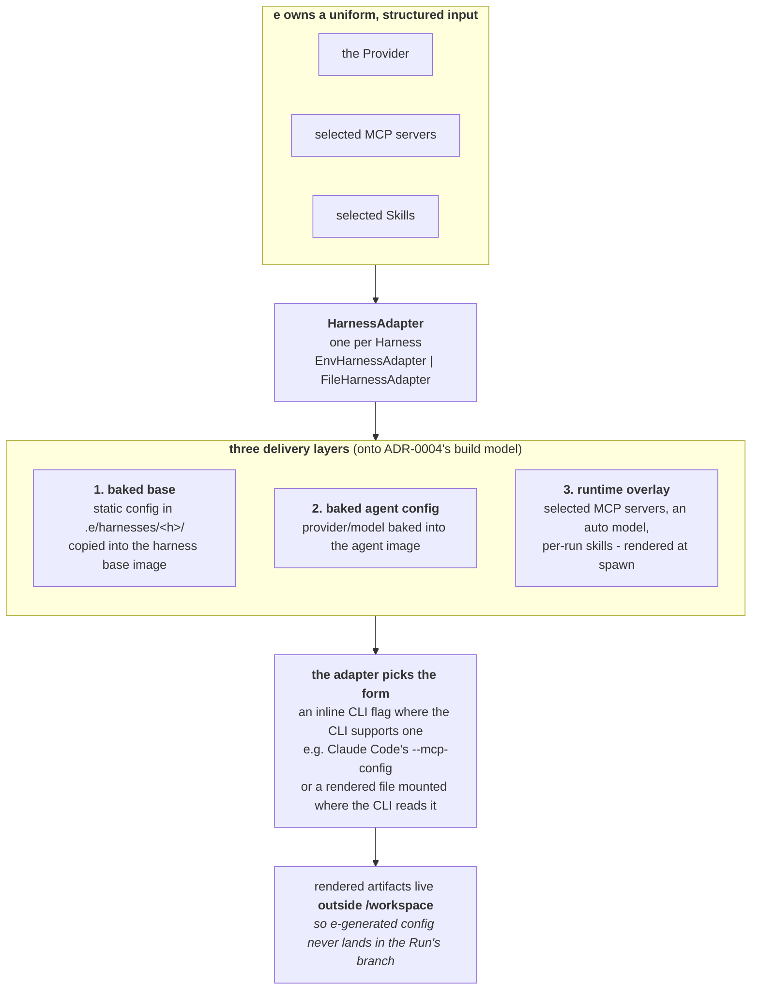
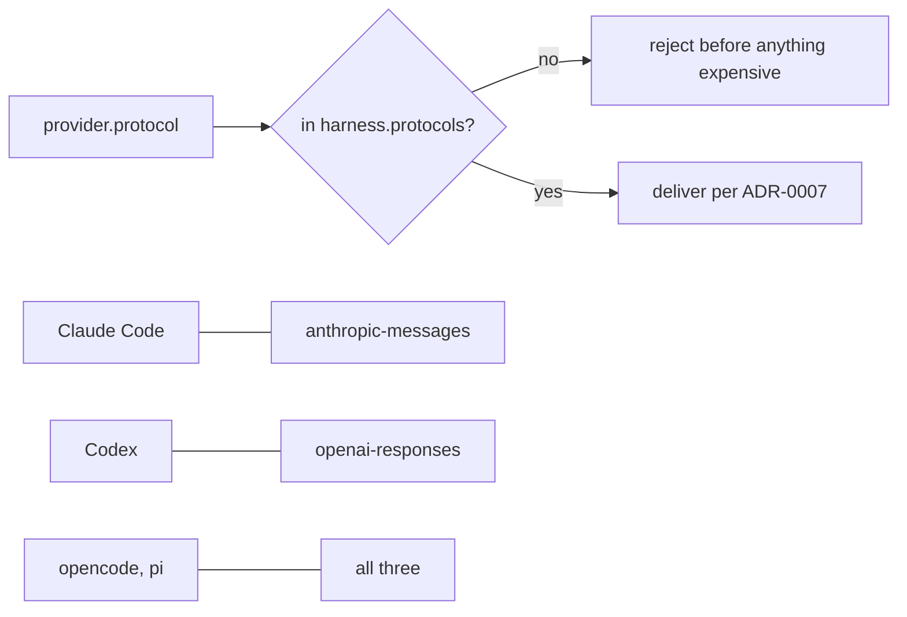

# Harness configuration is rendered by a per-harness adapter and delivered in three layers

**Status:** Accepted

Custom providers, MCP wiring, and skills all reduce to one problem: each harness
ingests configuration through its _own_ mechanism (env vars, config files, CLI
flags), while `e` can deliver only env vars. So `e` owns a **uniform, structured
input**: the provider, the selected MCP servers, the selected skills. Each
Harness owns an **adapter** that translates it into that harness's native form.

The adapter always renders the effective config and picks the _delivery form_
per harness: an inline CLI flag where the CLI supports it (e.g. Claude Code's
`--mcp-config`), or a rendered file mounted at the path the CLI reads. Either
way the rendered artifact lives **outside `/workspace`**, so `e`-generated
config never lands in the Run's branch.

Delivery is layered onto the build model of ADR-0004:

1. **Baked base**: a static base config shipped in `.e/harnesses/<h>/` and
   copied into the harness base image.
2. **Baked agent config**: the agent's provider/model baked into the agent
   image.
3. **Runtime overlay**: the per-run parts (selected MCP servers, an
   `auto` model delivered per the harness's form, per-run skills) rendered at
   spawn and delivered at runtime.

Two cross-cutting rules:

- **Credentials are referenced by name, not baked, with one exception.**
  Normally an image references only the env var _name_; the value lives in
  `.e/.env` (collected interactively by `e init`) and is injected at runtime,
  extending the credential boundary of ADR-0002. **pi is the exception:** it
  selects only models declared in `models.json`, so its adapter resolves the key
  by name and writes the _value_ into that baked file. The value therefore lands
  in the pi derived image: a deliberate trade-off pi's CLI forces, not the rule
  for the other harnesses (Claude Code and Codex still reference by name).
- **Protocol is validated against a per-harness set.** A provider's `protocol`
  is a specific wire API: `openai-chat` (`/v1/chat/completions`),
  `openai-responses` (`/v1/responses`), or `anthropic-messages`. Each Harness
  declares the _set_ it speaks (Claude Code: only `anthropic-messages`; Codex:
  only `openai-responses`; opencode and pi: all three). `e` rejects a
  `provider.protocol` not in `harness.protocols` early. "OpenAI-compatible" is
  not monolithic: a Chat-Completions-only endpoint will not work with Codex,
  which speaks only Responses. An `auto` model is delivered per ADR-0007: `e`
  carries no catalog and the harness resolves it against the provider's
  `/v1/models` at run start. Grounding: `docs/research/harness-cli-facts.md`.

## Uniform input, per-harness delivery

### Protocol is validated against a per-harness set

"OpenAI-compatible" is not monolithic, so `e` rejects a mismatch early rather
than letting the harness fail at run start.

## Considered Options

- **Thin passthrough** (the user hand-writes each harness's native config),
  rejected: does not scale across harnesses; a single MCP server would mean
  hand-authoring Claude's, Codex's, and opencode's formats.
- **A universal abstraction that hides harnesses entirely**, rejected: too
  leaky (auth headers, `/v1` path quirks, and per-CLI provider/MCP fields all
  differ).
- **Baking `auto`-selected models**, rejected: goes stale the moment a new
  model ships, and needs build-time network access and credentials.

## Consequences

- The `Harness` interface grows adapter responsibilities (render provider
  config, render run config, place skills), building on the existing
  `renderDockerfile` / `renderEnvTemplate` templates.
- `e` carries a maintenance burden: the model preference list drifts as models
  are released; users can override it with an explicit model or their own
  ranking.
- Config and skills must render outside the worktree, or they pollute the run
  branch's diff. Every harness supports this via a config-dir env var
  (`CLAUDE_CONFIG_DIR`, `CODEX_HOME`, `OPENCODE_CONFIG_DIR`,
  `PI_CODING_AGENT_DIR`). All four have an adapter wired; opencode's bakes
  `opencode.json` under `OPENCODE_CONFIG_DIR` but plans no MCP overlay yet.
- Not every capability is universal: pi ships no MCP client, so `e`
  capability-gates `--mcp` per harness; MCP delivery form also differs (Claude
  takes it inline via a flag; Codex and opencode need a rendered file). See
  `docs/research/harness-cli-facts.md`.
