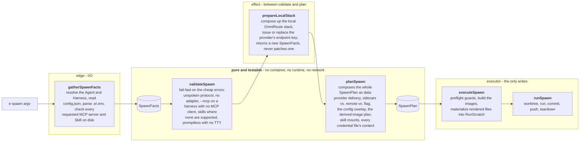

# Spawn is a pure plan plus a thin executor

**Status:** Accepted

`e spawn` is structured as a pipeline: **gather → validate → resolve model →
plan → execute**. Everything that _decides what a run is_ is pure and testable;
the only effects live in a thin edge and a single executor. This records the
split so a future review does not re-merge the decision logic back into the
command action (it had grown to ~400 lines of untested wiring before this).

## The pipeline

1. **`gatherSpawnFacts`** (edge, I/O) reads everything the decisions need (the
   resolved Agent and Harness, the parsed `.e/.env`, every requested MCP server
   and Skill, existence checked on disk) into a pure `SpawnFacts` value.
2. **`validateSpawn(facts)`** (pure, fail-fast) rejects the cheap-to-detect
   errors before anything expensive: a provider protocol the harness does not
   speak, a provider on a harness with no adapter, `--mcp` on a harness with no
   MCP client, skills on a harness that supports none, and a promptless spawn
   with no terminal to attach the harness TUI to (the prompt decides one-shot
   vs. TUI; the browser terminal's headless child is exempt, ADR-0014).
3. **`prepareLocalStack(facts, deps)`** (the one effect in the middle) brings
   the store's local OmniRoute stack up and makes sure the agent's provider
   holds an endpoint key that stack accepts, returning the `SpawnFacts` the plan
   is built from. It runs _after_ validation, because it can start containers
   and ask the user for a key. _(It replaced the removed model-resolution step;
   ADR-0007/ADR-0009 dropped resolving `auto` against `/v1/models` - the harness
   receives `auto` and resolves it at run start.)_
4. **`planSpawn(facts)`** (pure) composes the whole `SpawnPlan`
   as **data**: provider delivery, MCP sidecars vs. remote vs. flag vs. file,
   the config overlay, the derived-image plan, skill mounts, and every
   credential env-file's _content_ (resolving secrets by name and throwing on a
   missing one happens here: pure and testable).
5. **`executeSpawn(facts, plan, deps)`** performs the effects the plan names:
   preflight guards (a git repo), build the images, materialize each
   rendered file into `RunScratch` and wire the resulting paths, then hand the
   run's lifecycle to `runSpawn`.

### The pipeline as a picture

Everything that _decides what a run is_ is pure. The effects sit in exactly two
places: one edge that reads, one executor that writes.

Builds happen in `executeSpawn`, _before_ any worktree, which preserves the
ADR-0005 "build before worktree" invariant by construction rather than by
convention.

## Consequences

- **The interface is the test surface.** `validateSpawn` and `planSpawn` are
  ordinary pure functions over `SpawnFacts`; the composition that used to hide
  in the action closure (the fail-fast order, the per-harness branching, the
  credential rendering) is now asserted directly, without a container, a
  runtime, or the network.
- **Builds move up; `runSpawn` shrinks.** Image building lives in
  `executeSpawn`, before any worktree, preserving the ADR-0005 "build before
  worktree" invariant by construction. `runSpawn` no longer takes
  `ensureImage`/`ensureSidecarImages` closures or owns the `isRepo` guard; it
  receives a built `imageTag` and owns only the run lifecycle
  (worktree, run, commit, push, teardown). The build-effect closures that used
  to be defined in the action and invoked _inside_ `runSpawn` (a
  control-inversion across the seam) are gone.
- **One owner for throwaway secrets.** `RunScratch` owns every rendered
  credential env-file, the config overlay, and the build context; one
  `dispose()` replaces the two hand-threaded cleanup registries, so no
  fail-fast path can leak a mode-0600 secret by forgetting to clean up.
- **One error path.** The action is a single `try/catch` that disposes and
  exits; the ~9 scattered `try { ... } catch { console.error; process.exit(1) }`
  blocks are gone.

## Note on ordering (historical)

When step 3 still existed, credential rendering (and its "missing secret"
error) moved into `planSpawn`, which ran _after_ the model fetch. With the
fetch gone (ADR-0007/0009) the question is moot: every planning error surfaces
before any network call, build or worktree.

## Amendment: what "pure" has to mean mechanically

**Added after a review found the pipeline was not actually pure.** Everything
above described the intended shape. Nothing enforced it, and the code had drifted
away from it in four places at once:

- The action wrote `facts.localStackPresent` and `facts.storeEnv[apiKeyEnv]`
  _after_ `validateSpawn` had already passed. `localStackPresent` was declared
  optional only so that late write would type-check.
- `spawnPlan.ts` imported `SidecarPlan` from `runs/runSpawn.ts` and `BrokerPlan`
  from `runs/runBroker.ts`: the pure planner depended on the orchestrator that
  performs its plan.
- `SpawnFacts.egressBlacklistFile` was gathered and read by nobody.
- `worktreesDir` was defaulted twice - once by the edge, once again inside
  `runSpawn` - so the rule had two homes and could drift.

A description is not an invariant. These are the mechanical rules that make the
one above hold:

1. **`SpawnFacts` is `readonly`, field by field.** Not a convention - the
   compiler rejects the write. There is no "gather, then patch" phase.
2. **One I/O step in, one effect step in the middle, one executor out.**
   `gatherSpawnFacts` reads (including `config.json`, once - nothing downstream
   reads it a second time). `prepareLocalStack` performs the single effect that
   has to sit between validation and planning: bring the local OmniRoute stack
   up and get the agent an endpoint key it will accept. It returns a _new_
   `SpawnFacts`; it does not write into the one it was given. `executeSpawn`
   performs the plan.
3. **Validation stays in front of the effects.** `prepareLocalStack` can bring
   containers up and ask the user for an API key, so it runs _after_
   `validateSpawn` - a run that was going to be refused for a reserved `-e` must
   not first start a stack and prompt for a key. This is why the handshake is
   its own step rather than part of `gatherSpawnFacts`.
4. **The planner imports nothing from `engine/runs`.** The data both halves
   agree on - `SidecarPlan`, `BrokerPlan` - lives in `engine/sidecarPlan.ts`,
   below both, and the run-role contract in `engine/runRole.ts`. The dependency
   now runs plan → orchestrator only, in `executeSpawn`, which is the module
   whose job is to call it.
5. **A default has one home.** `worktreesDir` is resolved once, by the edge that
   gathers facts; `RunSpawnParams.worktreesDir` is required, so the orchestrator
   cannot quietly substitute a different one.

### What this bought

The 50-line local-stack and API-key handshake had **no test coverage at all** -
it sat in an anonymous action closure that `spawn.test.ts` replaces wholesale
with a recorder. It is now `prepareLocalStack`, whose terminal prompt is a
caller-supplied `askForKey` (asking a human is the CLI's job, not the engine's),
and every branch is covered: hosted providers never checked, an unreachable
gateway counted as accepting, a stale key replaced, the stack password rejected
and the user asked instead, and only the provider's own variable rewritten in
`.e/.env`.

The rest of the action moved with it. `runSpawnCommand` returns an exit code
instead of calling `process.exit`, and what a finished run _says_ is a pure
`spawnReport(result): ReportLine[]`. `process.exit` and the SIGTERM handler are
all that is left in the Commander action.
