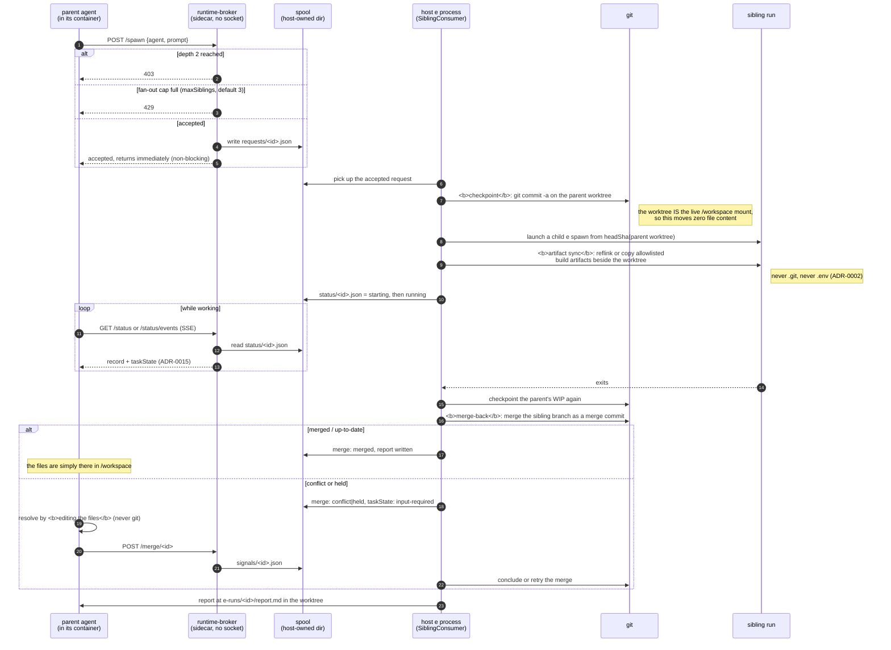
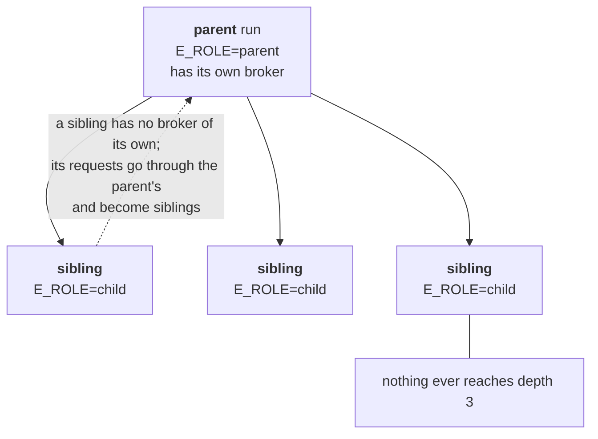

# ADR-0013: Nested Spawn via Runtime-Broker Sidecar

**Status:** Proposed
**Date:** 2026-09-10
**Related:** [ADR-0001 (per-run git worktree)](./0001-per-run-git-worktree.md), [ADR-0002 (host orchestrates git)](./0002-host-orchestrates-git.md), [ADR-0005 (composed container groups)](./0005-runs-as-composed-container-groups.md), [ADR-0008 (spawn as pure plan)](./0008-spawn-is-a-pure-plan.md)

## Decision

An agent inside a run can request **sibling** runs (e.g. "I'll do A, spawn brother to do B") without running a container runtime inside the run container. A **runtime-broker** sidecar owns the host's docker socket; the agent calls it over the run's private network. Children share the parent run's network and lifecycle; no grandchildren (depth capped at 2).

## Design

### Transport

- A `runtime-broker` sidecar attaches to the run's private network (ADR-0005 machinery, same pattern as MCP sidecars).
- It owns the host docker socket - never bind-mounted into the agent container (ADR-0002 credential line held).
- Agent calls it over HTTP: `POST /spawn {agent, prompt}` + query/response contract. The call lives in a Skill (`spawn-brother`) so no binary is injected; the harness uses its native shell/curl.
- Role is communicated by env vars injected per container (`E_ROLE`, `E_BROKER_URL`), not marker files in the worktree. No repo pollution, no gitignored surprises. AGENTS.md guidance checks `$E_ROLE`; the launch prompt states role behavior.

**Amendment (2026-09-12, ticket 02):** the broker does **not** own the docker socket after all. Mounting it into any per-run container would have moved the ADR-0002 trust line into the run's network; the ticket kept the line. The broker is an HTTP front for a host-owned **spool** directory bind-mounted into it: `POST /spawn` writes `requests/<id>.json`, the host `e` process (the only party with a runtime and git) consumes those and writes `status/<id>.json`, `GET /status` merges the two. The spool lives under the worktrees dir, the one host path every engine bind-mounts; it works identically on a private run network and in the shared `e-egress` namespace, where a published port could not. The broker sidecar is planned for a run exactly when the run carries the `spawn-brother` skill, which is also how the agent learns to call it.

### Non-blocking, parallel fan-out

- `POST /spawn` returns immediately (run created + starting). Multiple siblings run concurrently.
- Fan-out bound is configurable, default 3; broker rejects beyond `maxChildren`.

### Checkpoint + WIP commit on spawn

- At every spawn request the **host** auto-commits the parent worktree's WIP ("e/<agent>/<slug>-N") so the child's worktree branch has the parent's current state (ADR-0001 only carries committed ref; this closes the gap).
- This is host-side `git commit -a` on an already-bound worktree - zero data movement of file contents (the worktree IS the live /workspace mount).

### Artifact sync into children

- Gitignored build artifacts (e.g. `node_modules`) are **never** visible in child worktrees (ADR-0001, ADR-0002).
- Optional host-side copy step (after child worktree created, before child container starts): snapshot parent's artifacts into child scratch dir, bind-mount at same path. `cp --reflink` when same filesystem (instant CoW), else plain copy. **Allowlist only** (`node_modules` default, configurable); never `.env`/`.git` (ADR-0002 secrets line).
- Child is always free to regenerate its own env (e.g. `npm install`).

### Merge-back to parent

- On child exit (or at parent's poll), host merges child branch into parent branch as a **merge commit**.
- If parent has dirty edits overlapping the incoming changes, host folds parent's current WIP into the merge commit; the worktree is updated in place. Parent sees merged files on next read.
- Remaining overlap (in-flight between host commit and merge) → merge held pending; parent told to clear file(s) X; after signal host retries. No edit loss.
- Delivery to parent: files land in worktree + report at `e-runs/<child>/report.md`; `spawn-brother` skill tells agent to poll after request.

**Amendment (2026-09-12, ticket 07):** implemented as described, with the
"signal" made concrete: the parent's merge signal is one more broker route,
`POST /merge/<id>` (`spawn-brother.mjs --merge <id>`), spooled as
`signals/<id>.json` and taken by the host's consumer. The "fold" is a
checkpoint commit of the parent's WIP on its branch immediately before the
merge commit (with `--no-ff` any staged change would make git refuse, so the
checkpoint is the last index write), not a single squashed commit. A refusal
over files in flight is a `Git.merge` outcome (`refused`, the paths git
named), reported as `merge.status: held` with those files; a conflict is
`conflict` with the marked files, concluded by the host's `commitAll` on the
signal. `<child>` in the report path is the request id (`sib-NNN`). The
merge state travels in the sibling's status too (`merge`, `report`), so
`GET /status` shows it. The parent run's end retries held merges once more
after the parent's own output commit (which concludes an open conflict with
whatever the agent left).

### Depth cap (no grandchildren)

- Children run at level 2 only. A child's `spawn-brother` request is honored by the host broker as a sibling of that child (not a child of a child), depth enforced host-side. Children inherit parent run's network and broker; no new sidecars per child.

### Failure semantics (mirror ADR-0005)

- Sidecar (broker) readiness timeout → fail-fast before any parent agent starts, no child created.
- Child never becomes ready → spawn call returns failure report to parent; non-fatal to parent.
- Child crash/hang mid-run → parent continues; report surfaces failure. Parent may request another brother.

## The full sibling round trip

The broker holds **no** container socket and **no** credentials (the ticket-02
amendment above). It is an HTTP front for a host-owned spool directory, which
is why the ADR-0002 trust line survives nested spawn.

### Why the depth cap holds

## Consequences

- **Agent sandbox unchanged**: no docker socket, no host git credentials, no `.git` inside container (ADR-0002 lines preserved). The broker is the only new trust boundary, scoped to run network.
- **Image matrix stays flat** (ADR-0005 rejected bake-in of sidecars): `runtime-broker` is a standard sidecar image, composed per-run.
- **Host does all git + container lifecycle** - the agent only makes HTTP requests to its broker.
- **New capability surface**: the agent can fan out across siblings for parallelism (researcher split, role split) and recover a sibling's work into its own tree after merge.

**Amendment (2026-09-12, ticket 09, manual child):** a third request source -
the host itself. `e spawn --parent <branch> "<prompt>"` writes a sibling
request straight into the parent run's broker spool (`requests/<id>.json`),
no container: the user CLI only validates and prints the accepted JSON, then
exits. The parent's running `SiblingConsumer` picks the request up
unchanged - a manual child is a sibling run in every way (same
`SiblingConsumer` path, same spool/status contract, same merge-back and
report at `e-runs/<id>/report.md`).

- **A live parent is mandatory.** The parent worktree must exist and its
  spool must carry `run.json` (written when a parent starts with the
  `spawn-brother` skill and its runtime-broker). An orphan request - no
  parent, or one that never asked for a broker - is refused up front with
  `no live worktree` / `no runtime-broker`, so no request is ever spooled
  against a parent that cannot consume it.
- **Identity is the run branch.** `<branch>` is a run branch
  (`e/<agent>/<slug>-N`); its worktree and spool are derived host-side. The
  spool's `run.json` must name role `parent` (see below).
- **Depth stays two.** The manual caller is a depth-one user; the child it
  requests is depth two, no deeper. A caller that already wears child
  sibling markers, or a parent whose `run.json.role` is `child`, is refused
  (`depth is capped at two`).
- **Same fan-out cap.** The shared `maxSiblings` (default 3, host-configured,
  `E_MAX_SIBLINGS` when set) counts spool-sourced launches regardless of
  source; manual requests queue like broker ones while the cap is full.
- **Prompt required.** An empty prompt is refused (`manual child needs a
prompt`); A2A-style remotes still skip the container entirely.
- **Not a new role.** The manual child still launches with `E_ROLE=child`
  and reports to the parent's broker; no `manual` role value exists. Host
  CLI, serve UI, and in-run exec all funnel into this single request path.

## Out of scope

- Grandchildren / arbitrary depth - deliberately unsupported.
- Arbitrary host filesystem access from children - broker surfaces only spawn+status contracts, not a generic FS bridge.
