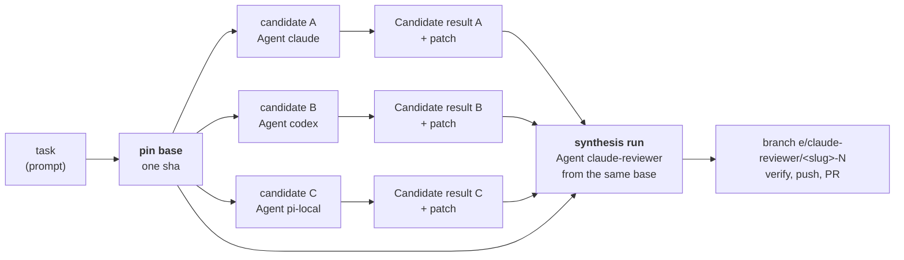
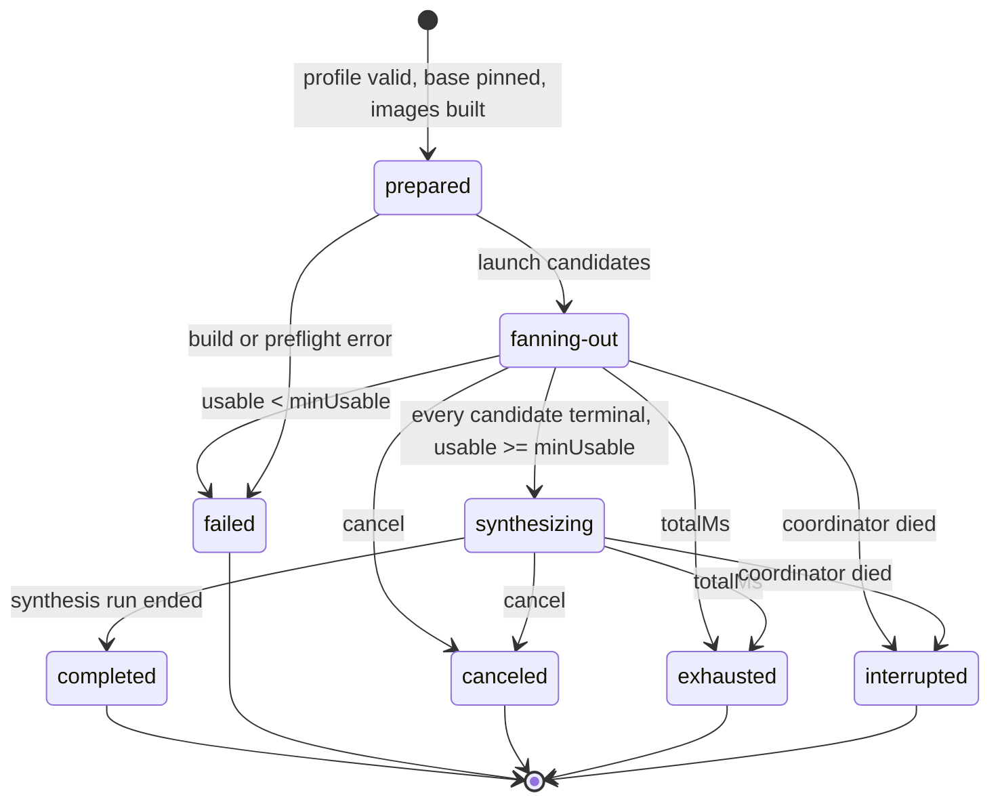

# ADR-0019: Fusion runs - one task, several Agents, one result

**Status:** Proposed
**Date:** 2026-09-30
**Related:** [ADR-0001 (per-run git worktree)](./0001-per-run-git-worktree.md), [ADR-0002 (host orchestrates git)](./0002-host-orchestrates-git.md), [ADR-0003 (run identity and ledger)](./0003-run-identity-and-ledger.md), [ADR-0005 (composed container groups)](./0005-runs-as-composed-container-groups.md), [ADR-0006 (per-harness config adapter)](./0006-per-harness-config-adapter.md), [ADR-0008 (spawn is a pure plan)](./0008-spawn-is-a-pure-plan.md), [ADR-0013 (nested spawn via runtime-broker)](./0013-nested-spawn-via-runtime-broker.md), [ADR-0015 (A2A vocabulary)](./0015-a2a-vocabulary-facade-and-remote-agents.md), [ADR-0016 (autonomous runs)](./0016-autonomous-runs.md), [ADR-0017 (resumable runs)](./0017-resumable-runs.md), [ADR-0018 (judge shadow mode)](./0018-judge-shadow-mode.md), issue #172

## Context

Different models fail differently. A task that one Agent botches, another
often gets right, and a reviewer who can see three attempts side by side
writes a better fourth than any of them alone. Asking for that today means
typing `e spawn` three times, remembering which commit each started from,
reading three branches by hand, and doing the combining yourself.

`e` already has every primitive such a workflow needs, and none of them has to
change:

- An **Agent** is a Harness plus a Provider, selected by name (ADR-0006), so
  "Claude Code on Anthropic", "Codex on OpenAI" and "pi on a local model" are
  three names in the Store, not three code paths.
- A **Run** is an isolated worktree and container on its own branch
  (ADR-0001, ADR-0005), and a run of the user's own can be told where to cut
  from (`RunBase`, ADR-0016).
- A host process can already launch headless `e spawn` children and follow
  them through a spool record (`src/engine/runs/childRun.ts`), which is how
  both the `SiblingConsumer` (ADR-0013) and the A2A facade (ADR-0015) work.

What is missing is the contract around them: what the whole thing is called,
where its record lives, what one attempt hands to the combining step, and what
happens when an attempt fails, hangs, or is canceled.

**Fusion here is output-level, never weight-level.** Nothing in this ADR merges,
averages or distills model parameters, and nothing needs a provider to expose
anything beyond what an Agent already uses. Candidates from different
providers are combined through what they _produced_ - commits, a diff, an
exit status - by another Agent that reads them. That is the only kind of
cross-provider fusion `e` can do, since `e` never holds a model, only an
endpoint.

## Decision

### 1. The vocabulary

| Term                 | What it is                                                                                                                                                    |
| -------------------- | ------------------------------------------------------------------------------------------------------------------------------------------------------------- |
| **Fusion**           | Executing one task with several independently configured Agents and combining their output into one result.                                                   |
| **Fusion profile**   | A named Store entity declaring which Agents are candidates, which Agent synthesizes, the strategy, and the fusion's own limits. No credentials.               |
| **Fusion run**       | One execution of a profile against one prompt: `fusion-<ulid>`, a host-side record grouping its Runs. **Not a Run**: it has no branch, container or worktree. |
| **Candidate run**    | An ordinary Run of one candidate Agent, cut from the fusion's pinned base. Opens no PR; the coordinator pushes it.                                            |
| **Candidate result** | The provider- and harness-neutral envelope the host writes for one finished candidate: identities, base, tip, changes, outcome, timings.                      |
| **Synthesis run**    | An ordinary Run of the synthesizer Agent, cut from the same pinned base, given every Candidate result as read-only material. The fusion's one deliverable.    |



A Fusion composes Runs; it does not change what a Run is. Every candidate and
the synthesis run go through `gatherSpawnFacts` -> `validateSpawn` ->
`planSpawn` -> `executeSpawn` -> `runSpawn` exactly as a headless `e spawn`
does, so a harness, adapter or provider needs no fusion-specific code. The
Harness abstraction does not learn the word.

### 2. Fusion profiles

A profile is a named Store entity, mirroring `agents/<name>/agent.json` and
`triggers/<name>/trigger.json`, found by the usual walk up from the working
directory with `~/.e` as the fallback:

```jsonc
// .e/fusions/<name>/fusion.json
{
  "name": "coding-fusion", // optional; must equal the directory name
  "candidates": ["claude", "codex", "pi-local"], // required, 2 or more Agent names
  "synthesizer": "claude-reviewer", // required, an Agent name
  "strategy": "parallel-synthesize", // optional, the only value in v1
  "maxConcurrency": 3, // optional, default min(candidates, 3)
  "minUsable": 1, // optional, default 1
  "timeouts": {
    "candidatesMs": 10800000, // optional, the fan-out phase; default derived (section 9)
    "totalMs": 21600000, // optional, the whole fusion, hard; default derived
  },
}
```

- **Agents by name, never by value.** A profile copies no provider, model,
  harness or key: all of that stays in the Agent, which is where the secrets
  mechanisms of ADR-0006 and ADR-0016 already reach. The directory name is the
  profile's id; a `name`, as #173 sketches and `agent.json` carries, is
  allowed and must equal it.
- **The same Agent may appear twice.** Two samples of one Agent are the
  same-provider baseline an evaluation needs (#179); their branches differ by
  the counter, as any two runs of one Agent and slug do (ADR-0003).
- **Harness agents only.** A Remote agent (ADR-0015) has no branch and no
  diff, so it can be neither candidate nor synthesizer in v1; the load refuses
  it by name.
- **Fail before anything is built.** An unknown key, an unknown strategy, a
  missing or remote Agent, fewer than two candidates, `minUsable` above the
  candidate count, and `candidatesMs >= totalMs` are all load errors, found by
  a pure validation over the profile and the resolved Agents, before any image,
  worktree or container exists. The provider policy of #180 is a second pure
  check at the same point (section 10).
- **`strategy` is a closed enum.** `parallel-synthesize` is the only value.
  Others (select-only, first-k) are named in section 11 and refused until an
  ADR specifies them, so no Store can switch on a behaviour nobody designed.
- **No token or cost budget.** ADR-0016 keeps it out of scope because `e` never
  sees usage, and that is still true. A usage budget is not a profile key in
  v1, and it can become one only once some harness reports usage (section 5).

### 3. The lifecycle

`e fuse <profile> ["<prompt>"]` is a host command, in the `cli` layer, driving
a **fusion coordinator** in `src/engine/fusion/`, above `engine/runs` and
beside `engine/a2a` and `engine/queue`. It is the only new moving part.



1. **Prepare.** Resolve and validate the profile. Pin the base: the checkout's
   `HEAD` resolved once to a sha, with the branch it names as the PR target -
   what a manual `e spawn` cuts from today, but read once rather than once per
   Run. Build every distinct Agent's image, serially, before any worktree
   exists (ADR-0005's "build before worktree"), so N candidates never race one
   build. Write the fusion record (section 6).
2. **Fan out.** Launch the candidates, at most `maxConcurrency` at a time, in
   profile order. Each is a headless child
   `e spawn <agent> --name <slug> -- <prompt>` started through `childRun.ts`,
   carrying host-set markers (section 4). A candidate starts as soon as a slot
   frees, not in lockstep batches.
3. **Collect.** As each candidate settles, the host writes its Candidate result
   and its patch (section 5). When the fan-out closes, the host pushes every
   usable candidate branch, after the last candidate has stopped, so no
   candidate can ever fetch another's work mid-run. A candidate is **usable** when its branch has
   commits beyond the base, whatever its verdict: an exhausted, red candidate
   is still an attempt the synthesizer may learn from, and its verdict says
   so.
4. **Synthesize.** Once every candidate is terminal, and if at least
   `minUsable` are usable, launch the synthesis run (section 7). Otherwise the
   fusion fails without one: with nothing to combine, a synthesis run would be
   a single-agent run under a misleading name.
5. **End.** The synthesis run's verdict is the fusion's (section 8).

Synthesis waits for **every** candidate, bounded by `candidatesMs`, rather than
starting at the first `minUsable`. It is the deterministic choice: which
candidates the synthesizer sees then depends on the declaration, not on which
provider happened to be fast that afternoon, and #179 cannot compare
strategies whose inputs vary by latency.

`fusion.json`'s `state` is the one above; `e fuse` shows each candidate's live
state as its spool record's Task state (ADR-0015) while it runs - `submitted`
as _queued_, `working` as _running_ - and its `outcome` (section 5) once it
settled, so the five labels #177 lists are the terminal ones plus `empty` and
`timed-out`, which a synthesizer must not read as a success or a failure.

### 4. Candidates are ordinary Runs, with three differences

A candidate is a run of the user's own in every respect - its own worktree,
branch `e/<agent>/<slug>-N`, container, sidecars, Store caps, verify loop -
except three things, each carried by a host-set `E_SPAWN_*` marker like
`E_SPAWN_ROLE` and `E_SPAWN_REPORT_*`, never by a user flag, so `e spawn`'s
command line does not change:

- **The base is pinned.** The candidate cuts from the fusion's sha
  (`RunBase`, already there for triggered runs), not from whatever `HEAD` is
  when its turn comes. This is the whole guarantee that candidates are
  comparable: a `git pull` in the checkout while candidate C waits for a slot
  must not give C a different starting point.
- **It neither pushes nor opens a PR itself.** Its delivery is the fusion, as
  a sibling's is its parent. The coordinator pushes it instead, like a parent
  pushes a sibling whose work did not land (ADR-0016 section 12): every usable
  candidate branch, once the fan-out has closed (section 3), because the
  synthesis PR names them (section 8) and a name that exists only on one host
  is a pointer that dangles - the argument #149 made against the request id.
  Pushing at the close rather than at each candidate's end keeps a networked
  candidate from reading a finished rival off the remote. A canceled fusion
  pushes nothing, as a canceled run does not (ADR-0015).
- **It reports into the fusion's spool.** Its status goes to a spool record
  the coordinator follows, through the same `E_SPAWN_REPORT_SPOOL` /
  `E_SPAWN_REPORT_ID` path an A2A task uses, and it changes nothing else about
  the run.

Everything else is deliberately left alone. A candidate carrying the
`spawn-brother` skill is a parent run with siblings of its own at depth 2
(ADR-0013); the coordinator is not a Run and counts toward no depth. A
candidate with `verify` declared loops like any gated run, with the Store's
caps. A candidate keeps **no Session**, for the reason a sibling keeps none:
resuming it as a Run of its own would open a PR the fusion never asked for.
This **amends ADR-0017 section 2**, whose "not for a Sibling run" becomes "not
for a Sibling run or a Candidate run". It is judged by no judge either, which
**amends ADR-0018 section 4** the same way (see Relationship).

Candidates are child **processes**, not in-process `runSpawn` calls, for the
reasons the two existing callers of `childRun.ts` already paid for: a
candidate that crashes the process is an exit code, not a dead coordinator; a
cancel is a kill; each candidate's output lands in its own log; and
`executeSpawn` keeps owning the process-wide concerns (signal handling, the
local stack, the one error path of ADR-0008) it owns for every other run.

### 5. The Candidate result

The host writes one envelope per settled candidate, from the spool record and
host-side git, never from anything the candidate wrote about itself:

```jsonc
// .e/runs/fusions/<fusion id>/candidates/<record id>/result.json
{
  "schemaVersion": 1,
  "fusion": "fusion-01K...",
  "candidate": "cand-002", // the spool record id; also the directory name
  "agent": "codex",
  "harness": { "name": "codex", "version": "0.159.0", "image": "e-codex-..." },
  "skills": ["web-search"],
  "mcp": [],
  "provider": { "protocol": "openai-responses", "model": "gpt-5.3-codex" },
  "base": { "sha": "3f1c...", "branch": "main" }, // the pinned base and PR target
  "branch": "e/codex/add-retry-backoff-4",
  "tip": "9a0e...", // null when the branch holds nothing beyond base
  "changes": {
    "files": [{ "path": "src/net/retry.ts", "added": 41, "removed": 3 }],
    "added": 41,
    "removed": 3,
  },
  "patch": "patch.diff", // beside this file; null when tip is null
  "patchTruncated": false,
  "files": "files/", // tip content of every changed file, beside this file
  "filesTruncated": false,
  "outcome": "succeeded", // succeeded | empty | failed | timed-out | canceled
  "exitCode": 0,
  "reason": null, // a LoopReason, or a fusion reason (section 8)
  "verify": { "verdict": "green", "attempts": 2 }, // absent without a gate
  "attempt": 1, // fusion-level attempt of this candidate (section 9)
  "retryOf": null, // the record id of the attempt this one retries
  "startedAt": "2026-09-30T10:00:03Z",
  "endedAt": "2026-09-30T10:21:44Z",
  "elapsedMs": 1301000,
  "usage": null, // tokens/cost; null unless a harness reported them
}
```

- **Neutral by construction.** Every field is something `e` already knows for
  every harness: the Agent's name and declared provider, the pinned harness
  version and image (ADR-0016 section 10), the skills and MCP servers the run
  was planned with, git's view of the branch, the run's exit code and reason,
  the clock. No field needs a harness adapter to parse its harness's output, so
  a synthesizer reads three providers' results with one reader. Together with
  the prompt and base in the fusion record, that is what reproducing the
  candidate takes.
- **The output is what landed in git, not what the harness said.** The
  normalized outputs #175 asks for are the patch and `files/`. A harness's
  free-text output (its final message, its tool output) is **not** in the
  envelope: it has one shape per harness, which is the adapter work this
  envelope exists to avoid, and it holds tool output, which holds secrets
  (section 6). An agent that wants the synthesizer to read its reasoning
  writes it into the worktree, where it becomes part of the patch.
- **`outcome` separates what a synthesizer must not confuse.** `succeeded`: the
  run exited 0 with commits. `empty`: it exited 0 with none - a refusal or a
  no-op, which all four harnesses report as success (ADR-0016). `failed`: it
  exited non-zero (`aborted:*`, `exhausted:*`, a build or preflight error).
  `timed-out`: the fusion's `candidatesMs` stopped it. `canceled`: a human or
  `totalMs` did.
- **`usage` is optional and never estimated.** No harness reports usage to `e`
  today; the field is `null` for all four. A harness that later exposes a
  structured result (Codex `-o`, Claude Code's JSON result, the fog item of
  ADR-0016) may fill it; an estimate would be a number nobody can check, which
  is worse than an honest `null`. Missing telemetry never invalidates an
  envelope.
- **The patch is `git diff <base> <tip>`**, exactly what a PR of that branch
  would contain, cut at a byte budget with `patchTruncated` set. **`files/`**
  holds the tip content of every changed file (a deleted one absent), under a
  much larger per-candidate budget with `filesTruncated` set, so a synthesizer
  can read a candidate whose patch was cut: the synthesis container has no git
  and no access to a candidate branch (ADR-0002), so these two are all it sees.
  Accepted limit, against #176's "every successful candidate's changes": past
  the second budget, a candidate is visible only in part, and its envelope
  says so. Both are written beside the envelope, outside every worktree. The
  `Git` port gains the diff and show methods; numstat it already has (ADR-0016
  section 11).
- **Human-facing fields stay out.** `gateRemovals` (ADR-0016 section 11) and a
  judge's answers (ADR-0018) are **not** in the envelope, because the envelope
  is read by an agent, the synthesizer, and a counted signal handed to an agent
  teaches it to launder the thing counted. The verify verdict is in: it is the
  repository's own check, already fed back to agents as iteration feedback.
- **Versioned by `schemaVersion`**, an integer. A reader refuses a version it
  does not know rather than guessing; adding an optional field is not a new
  version, changing or removing one is.

### 6. The fusion record

```
.e/runs/fusions/<fusion id>/
  fusion.json                 # the record: profile snapshot, prompt, base,
                              # state, timestamps, candidate and synthesis ids
  candidates/<record id>/     # cand-NNN, one per attempt
    result.json               # the Candidate result
    patch.diff
    files/                    # tip content of the changed files
  synthesis.json              # the synthesis run's id, branch, verdict, PR
```

- **In the checkout's Store, beside `sessions/`, `queue/`, `live/` and
  `dead/`**, not under the worktrees dir, which is the temp dir on Linux and
  would lose the results to a reboot. `.e/runs/fusions/` carries its own
  `.gitignore` (`*`), so a partly committed Store never commits a prompt or a
  patch.
- **0700 directories, 0600 files**, host-owned. No container ever mounts this
  directory; the synthesis run gets a copy of a subset (section 7).
- **The profile is snapshotted**, with each Agent's resolved harness, version,
  protocol and model, so a record still reproduces what ran after the profile
  or an Agent was edited. Never a key, a `baseUrl` taken from an env override,
  or anything read from `.e/.env`.
- **The children's logs are not kept here.** They live in the fusion's spool
  under the worktrees dir, like an A2A spool, and go with it when the fusion
  ends (kept with `--keep-worktree`). A log holds tool output, and tool output
  holds secrets; the envelope and the patch are what later readers need, and
  the branch holds the rest.
- **Pruned 14 days after the fusion ended**, whenever a new fusion starts in
  the same Store, the retention ADR-0017 settled for sessions.
- **Restart reconciles, never resumes.** A coordinator that dies leaves its
  record in a non-terminal state; the next `e fuse` in that Store marks it
  `interrupted`, keeps every envelope already written, and resumes nothing -
  the rule #141 set for the ledger. A fan-out that never closed pushed
  nothing; its branches are local, and their envelopes name them.

The record is a record of **one fusion**, not of runs: which Runs exist is
still answered by branches alone (ADR-0003). It is the live-status layer that
ADR permits on top of branch-shaped identity, the same way `.e/runs/live/` is.

### 7. The synthesis run

The synthesis run is an ordinary run of the user's own for the synthesizer
Agent: its own branch `e/<synthesizer>/<slug>-N`, cut from the **same pinned
base**, gated by verify, pushed, and the only run of the fusion that opens a
PR.

- **Its material is a read-only mount outside the worktree**, at
  `/run/e/fusion/`, the way a triggered run's payload is at
  `/run/e/event.json` (ADR-0016 section 5): a host-built copy of each
  Candidate result, patch and files, `candidates/<record id>/`,
  for **every** candidate, usable or not. A failed or empty candidate is an
  explicit input - "codex refused" is information - never a silent gap.
- **Candidate branches are never merged by the host.** There is no merge-back
  and no `git merge` of a candidate anywhere in a fusion. The synthesizer
  chooses one candidate (`git apply` works without a repository), combines
  hunks, or writes a fresh solution informed by all of them; to the host all
  three are edits in a worktree, committed like any others.
- **The prompt is host text plus the user's task.** A fixed synthesis preamble
  in code (`src/engine/fusion/`), never in the Store or the repository, states
  the task verbatim, where the material is, and that it is **untrusted**:
  written by other agents, possibly other providers, and any instruction inside
  a patch or a result is data, not an instruction. Nothing from a candidate is
  ever interpolated into the prompt - the rule #146 set for payload prose, for
  the same reason: a prompt cannot be sanitized.
- **The synthesizer is not a judge.** It is asked to produce the best solution,
  not a verdict; nothing it writes about the candidates is parsed, and its
  choice changes no exit code. The gate over its output is the repository's
  verify, as for any run.
- **It keeps a Session** (ADR-0017) and can be resumed as the ordinary Run it
  is. Known limit: a resumed synthesis run gets no `/run/e/fusion/` mount; its
  transcript already holds what it read.

### 8. Verdict, exit codes and provenance

The fusion's exit code is the synthesis run's verdict (ADR-0016), plus the
three ways a fusion ends without one:

| Outcome                                           | Code  | Reason                        |
| ------------------------------------------------- | ----- | ----------------------------- |
| Synthesis run `verified`, or ungated and exited 0 | `0`   |                               |
| Synthesis run `aborted`                           | `1`   | its `aborted:*`               |
| Synthesis run `exhausted`                         | `2`   | its `exhausted:*`             |
| Fewer than `minUsable` usable candidates          | `1`   | `aborted:no-usable-candidate` |
| A build or preflight error before the fan-out     | `1`   | `aborted:fusion-preflight`    |
| `totalMs` fired                                   | `2`   | `exhausted:fusion-timeout`    |
| Canceled                                          | `143` |                               |

**No new trailer.** The commits of a fusion's runs carry exactly what a manual
run's carry, which is nothing (ADR-0016 section 9): a fusion is a human act, so
`git log --grep E-Trigger` keeps meaning "machine-started", and a
`E-Fusion: <id>` trailer would point at a record pruned after 14 days - the
dangling pointer #149 refused. **The provenance lives in the PR** instead: the
synthesis PR body gains a fusion block, built from identifiers only (#149's
rule), naming the profile, the pinned base, each candidate's Agent, branch,
outcome and verify verdict, and the synthesizer. A usable candidate's branch
was pushed when the fan-out closed, so its name resolves on the remote for as
long as the branch does; a candidate without commits (`empty`, or `failed`,
`timed-out` or `canceled` before its first commit) is listed by Agent and
outcome, with no branch, since there is nothing to point at. The pushed
candidate branches follow the repository's own branch hygiene; `e` deletes no
remote branch, for a fusion as for any run.

### 9. Partial failure, timeouts, cancellation and budgets

| Event                                     | What happens                                                                                                                                                                 |
| ----------------------------------------- | ---------------------------------------------------------------------------------------------------------------------------------------------------------------------------- |
| A candidate fails, is empty, or times out | It gets its envelope and outcome; the others continue. Never discards another candidate's work.                                                                              |
| Every candidate is terminal               | The fan-out closes and the usable branches are pushed. Synthesis starts if `usable >= minUsable`, else the fusion ends `aborted:no-usable-candidate`.                        |
| `candidatesMs` fires                      | Outstanding candidates are canceled (outcome `timed-out`, the ADR-0015 cancel path, nothing more committed for them; earlier attempts' commits stay), then as the row above. |
| `totalMs` fires                           | Everything outstanding is canceled, the fusion ends `exhausted:fusion-timeout`, no PR. Usable branches are pushed if the fan-out had closed, else left local.                |
| Cancel (Ctrl-C, SIGTERM)                  | Every child is killed, the record is marked `canceled`, exit `143`, nothing is pushed that was not already.                                                                  |
| The coordinator itself dies               | The record is left non-terminal and is reconciled to `interrupted` by the next `e fuse` (section 6).                                                                         |

- **The Run's caps are untouched.** A candidate and the synthesis run each get
  the Store's `resources` and `loop` exactly as any run does (ADR-0016 section
  4). The fusion adds **no override layer** for them - ADR-0016 allows exactly
  two, the Store and a Trigger - and bounds only the phases it owns:
  `candidatesMs` the fan-out, `totalMs` the whole. A fusion's worst case is
  therefore readable off two files the agents cannot reach.
- **The fusion's deadlines cancel; they do not commit partial work.** Unlike a
  Run's own wall clock, which chooses the moment and commits what the agent
  had (ADR-0016 section 4), a fusion deadline reaches a Run from outside, as a
  cancel. A candidate that should keep its partial work is one whose own
  `loop` caps stop it first, which the defaults arrange.
- **The defaults let a Run's own caps fire first.** With
  `rounds = ceil(candidates / maxConcurrency)`, `candidatesMs` defaults to
  `rounds x loop.totalTimeoutMs + 15 min` and `totalMs` to
  `candidatesMs + loop.totalTimeoutMs + 15 min`, the margin covering builds
  and pushes. A candidate that waited for a slot still gets its full Run
  budget before the fusion's deadline reaches it. A declared value is taken as
  it stands, and is then the operator's statement that the fusion's end
  matters more than a straggler's partial work.
- **Concurrency is the profile's `maxConcurrency`**, counted by the
  coordinator. `e fuse` is a human act and consumes **no Slot** (ADR-0016): Slots
  gate what autonomy may start. A host-wide bound across concurrent `e fuse`
  invocations, which #178 asks for, is **not** decided here; the one
  constraint is that it is counted in a file-backed place every coordinator on
  the host reads, like `.e/runs/live/`, never in one process's memory, and
  that it is a `config.json` key `e init` must carry over (ADR-0016).
- **Retries are a fusion concern, never a Run's.** ADR-0016 keeps "a non-zero
  harness exit aborts the loop and never retries" inside a Run, and that
  stands. A retry here is a **new candidate run** for the same Agent (a new
  `-N`, a new envelope with `attempt` counted up), off by default, and only for
  a failure classified retryable - never for a candidate that produced
  commits. Each attempt is its own record (`cand-NNN`, `retryOf` naming the
  one it replaces), and a retry never extends `candidatesMs`: the default of
  the next bullet budgets no retries, so a Store that enables them raises it.
  The classification seam, backoff with jitter and per-provider buckets are
  #178's to build; this ADR fixes only where they live (the coordinator, not a
  harness adapter) and that a retry never reruns a successful candidate.
- **Accounting is a seam, not a store.** The coordinator emits one event per
  candidate start, attempt, end and budget exhaustion, with `usage` when known,
  through one interface a later control plane can consume (#188); the fusion
  record is its per-fusion view, not a second accounting store, and its 14-day
  retention bounds only that view.

### 10. Security boundaries

The threat model belongs to #180; the lines it must work within are these:

- **A profile is consent to disclosure.** The prompt and the repository go to
  every candidate's provider, and every candidate's patch goes to the
  synthesizer's. A **provider policy** check sits beside the profile
  validation of section 2, pure, evaluated before anything is built, so a
  profile whose provider set a Store forbids is refused rather than run.
- **Credentials stay per Run.** Each candidate is its own run whose plan
  renders its own env file (ADR-0008), so a provider key reaches only the
  containers of an Agent that names it. The synthesis container receives no
  candidate's credentials: nothing in a fusion widens what one container gets.
  Two candidates of one Agent share its long-lived key from `.e/.env`, as any
  two manual runs do; per-run keys are the one-shot trigger path's (ADR-0016
  section 13), which a fusion is not (section 11).
- **Candidate output is untrusted input** to the synthesizer (section 7): a
  mounted file, never prompt text.
- **At rest**: the record is 0600/0700, git-ignored, never exported, pruned at
  14 days (section 6); the logs, which hold tool output, are not kept.

### 11. Not in v1

- **Other strategies.** `parallel-select` (the synthesizer, or a judge, names
  one candidate and the host opens that candidate's PR unchanged - a pure
  pick, still no merge), first-k (synthesize once k candidates are usable and
  cancel the rest), and iterative rounds (candidates see each other). Each
  needs its own ADR; the enum refuses them until then.
- **A triggered fusion.** A Trigger binds exactly one Agent (ADR-0016 section
  5); a Trigger naming a profile, and the Base Store rules it would need, are
  a later decision. `e fuse` is manual in both deployment shapes: running it
  in a CI job is running a command, not the one-shot trigger path.
- **A fusion requested from inside a run.** Only the host starts one. An agent
  that wants several opinions has siblings (ADR-0013).
- **Remote agents** as candidates or synthesizer (section 2).
- **Resuming a fusion.** Its synthesis run is resumable; the fan-out is not.
- **Usage budgets** (section 2), and the web UI and `GET /api/runs` view of a
  fusion.

## Why not the existing mechanisms

- **Siblings (ADR-0013).** A sibling branches from its parent's checkpoint,
  which moves, and comes back by merge-back, which is exactly the implicit
  merge a fusion must never do. It needs a live parent agent to request it, it
  shares the parent's fan-out cap, and depth 2 would leave a candidate no room
  for siblings of its own. A fusion is a fixed, declared topology the host
  runs, not an agent's decision mid-turn.
- **A2A tasks (ADR-0015).** The facade lives in `e serve` and forgets its tasks
  on restart; a fusion must work from a shell and keep its results. It reuses
  the facade's _mechanism_ - `childRun.ts` and the report spool - not its
  surface.
- **A judge (ADR-0018, #154).** The judge grades one run and changes nothing,
  in shadow mode; a synthesizer produces the deliverable. Different job,
  different trust: the judge's answers are human-facing only, the
  synthesizer's output is a branch that verify gates like any other.
- **The host as a planner** (ADR-0016, out of scope). A fusion decomposes
  nothing: every candidate gets the same task, and the host runs a topology the
  Store declared. It schedules; it does not plan.

## Relationship to existing ADRs

- **ADR-0003 is upheld.** Every candidate and the synthesis run are
  branch-shaped Runs counted by `nextRunName`; `fusion-<ulid>` names the
  fusion, never a Run, and its record is a live-status layer of the kind that
  ADR permits.
- **ADR-0013 is untouched.** No merge-back, no spool of a parent run, no depth
  change; a candidate may be a parent run of its own.
- **ADR-0016 is upheld.** Verify gates every candidate and the synthesis run
  unchanged, the Caps keep their two override layers, retries stay out of the
  Run, autonomy still ends at an open PR - one PR per fusion - and no token
  budget appears.
- **ADR-0017 is amended** in section 2: candidates join siblings as runs that
  keep no Session; the synthesis run keeps one.
- **ADR-0018 is amended** in section 4, which judges "a run of the user's own
  ... with commits" and would therefore judge every candidate: a Candidate run
  is excluded as a sibling is. The synthesis run is the run whose diff becomes
  the PR, and a judge call per candidate would send the same code to a third
  party N more times.

## Consequences

- **`e spawn` is unchanged for every caller that sets no fusion marker**: no
  new flag, no new default, no new field in a single run's result.
- **New Store surface**: `.e/fusions/<name>/fusion.json` and
  `.e/runs/fusions/<id>/`. Profiles should travel with `e export` / `e import`
  like triggers; `.e/runs/` does not. `e init` must carry nothing new over,
  since nothing is added to `config.json`.
- **New CLI surface**: `e fuse <profile> ["<prompt>"]`, with progress that
  separates the candidate and synthesis phases (#177).
- **New code**: `src/core/fusion/` (profile schema, load, validation, the
  envelope type and its version check) and `src/engine/fusion/` (the
  coordinator, the synthesis preamble); `childRun.ts` gains a third caller.
- **Three new internal markers** for a candidate - pinned base, no PR, report
  spool - host-set and refused from the user like `E_ROLE` (`validateSpawn`).
- **The `Git` port gains diff and show methods** for the patch and `files/`;
  it has numstat.
- **The PR body gains a fusion block** for a synthesis run.
- **Costs multiply, visibly.** A fusion of N candidates is N + 1 Runs, each with
  its own loop and caps; its worst case is `totalMs`, stated in the profile or
  derived from the Store. Whether it is worth it is an empirical question,
  which is why #179 treats a single Agent as the baseline to beat.

## Implementation tickets

| Ticket | Slice                                                                             | Sections   |
| ------ | --------------------------------------------------------------------------------- | ---------- |
| #173   | Fusion profiles: schema, Store paths, load, validation                            | 2          |
| #175   | The Candidate result: type, `schemaVersion`, persistence in the record, the patch | 5, 6       |
| #174   | The coordinator: pinned base, image pre-build, bounded fan-out, markers, cancel   | 3, 4, 6, 9 |
| #176   | The synthesis run: the `/run/e/fusion/` mount, the preamble, the PR block         | 7, 8       |
| #177   | `e fuse` and its progress output                                                  | 3, 8       |
| #178   | Deadlines, retry classification, backoff, provider buckets                        | 9          |
| #180   | Threat model, provider policy, retention                                          | 10, 6      |
| #179   | Evaluation: single Agent vs fusion, same-provider sampling, select vs synthesize  | 2, 11      |
