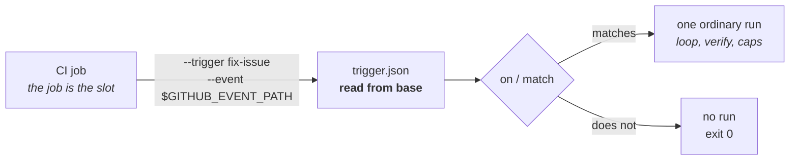

# Tutorial 10: a trigger in CI, one-shot

Goal: run a Trigger from a CI job with `e spawn --trigger <name>`, so an
issue labelled `agent` becomes a run branch and a PR without an `e serve`
anywhere.

Prerequisite: one working Agent ([Tutorial 1](./01-first-run.md)) and a
repository on GitHub. The reasoning is in
[ADR-0016](../adr/0016-autonomous-runs.md), section 13.

## Two shapes, one declaration

A Trigger runs in one of two shapes. **hosted** is a long-lived `e serve`
that owns the scheduler, the webhook listener, the queue and the ledger.
**one-shot** is a single `e spawn --trigger <name> [--event <path>]`, started
by whatever surrounds it - a CI job, a systemd timer, a k8s CronJob - which
then owns scheduling, dedup and concurrency instead. The loop, the verify gate
and the caps are identical in both, because they live in the run itself.



What `serve` owns is **void** in one-shot: the queue, slots, dedup, the
ledger, `nextFireAt`/`lastFiredAt`, `GET /api/runs` and A2A cancel. Siblings
and the runtime-broker still work, being per-run.

## Step 1: commit the Store

In a runner the home directory is empty, so the repository carries the Store.
Commit `.e/` - the trigger, the agent, the verify command and the caps are
then reviewed through PRs like any other code. `e`'s own repository
gitignores `.e/`, so adopting one-shot is a deliberate act: take `.e` out of
your `.gitignore`, and keep `.e/.env` in it.

```bash
e init --dir .
printf '.e/.env\n' >> .gitignore
```

The trigger's Agent needs a **Provider**. In one-shot the secrets file is
filtered to the variables the run declares, exactly like `.e/.env`, and a
bare harness (`claudeCode` with no `provider`) declares no key, so its
container would start without one. Declare an Agent whose `apiKeyEnv` names
the key (the shape is [Tutorial 1](./01-first-run.md)'s, the options
[Tutorial 2](./02-hosted-provider.md)'s):

```bash
mkdir -p .e/agents/claude-ci
cat > .e/agents/claude-ci/agent.json <<'JSON'
{
  "name": "claude-ci",
  "harness": "claudeCode",
  "provider": {
    "baseUrl": "https://api.anthropic.com",
    "model": "claude-sonnet-4-5",
    "protocol": "anthropic-messages",
    "apiKeyEnv": "ANTHROPIC_API_KEY"
  }
}
JSON
```

## Step 2: declare the trigger

```jsonc
// .e/triggers/fix-issue/trigger.json
{
  "agent": "claude-ci",
  "prompt": "Fix issue #{{issue.number}} in {{repository.full_name}}. Read the issue with the gh CLI; the full event is at /run/e/event.json.",
  "on": {
    "type": "webhook",
    "source": "github",
    "event": "issues",
    "action": "labeled",
    "match": { "label.name": "agent" },
  },
}
```

Only validated identifiers interpolate (`issue.number`, `repository.full_name`,
`label.name` and a few more); the issue's title and body never reach the
prompt. The agent fetches the text itself, or reads the whole payload, which
is mounted read-only at `/run/e/event.json`, outside the worktree, so it can
never ride along in a commit.

Check it loads:

```bash
e trigger list
```

Commit the trigger to your default branch. **The declaration is read from
`base`, never from the working tree**: in a `pull_request` job every file but
the workflow comes from the PR's head, so a `trigger.json` on disk is
whatever the PR's author wrote. `e` reads it with `git show <base>:...`, and a
trigger that is not committed there is refused.

**So is the rest of the Store.** A head that cannot touch the prompt could
still weaken `verify` in `config.json`, swap the Agent, or rewrite a
Dockerfile that is built on the runner. The run therefore reads its **Base
Store**: the whole `.e/` as committed at the base, copied into a scratch
directory for this one run and removed with it; nothing of the working
tree's `.e/` is read, and the siblings the run starts read the same copy.
The Store is `--dir` when you pass one, else `.e/` at the repository's top
level - never the nearest `.e/` above the working directory, which a nested
one in the head could move. So commit everything the run needs, the harness
Dockerfiles `e init` wrote included: running `e init` on the runner changes
nothing the run reads. A `compose.yaml` in it is not used, since one-shot
never starts a local stack.

## Step 3: the workflow

```yaml
# .github/workflows/e-fix-issue.yml
name: e fix-issue
on:
  issues:
    types: [labeled]

concurrency:
  # The outer scheduler owns dedup: one run per issue at a time.
  group: e-fix-issue-${{ github.event.issue.number }}

jobs:
  run:
    if: github.event.label.name == 'agent'
    runs-on: ubuntu-latest
    # Keep loop.totalTimeoutMs (3 h by default) under this.
    timeout-minutes: 240
    permissions:
      contents: write
      pull-requests: write
      issues: read
    steps:
      - uses: actions/checkout@v4
        with:
          # The base must resolve locally; a shallow clone often lacks it.
          fetch-depth: 0

      - name: Install e
        run: |
          gh release download --repo BelphegorPrime/e --pattern 'e-linux-x64.tar.gz'
          tar -xzf e-linux-x64.tar.gz && sudo install -m 0755 e /usr/local/bin/e
        env:
          GH_TOKEN: ${{ github.token }}

      - name: Secrets, outside the checkout
        run: |
          umask 077
          printf 'ANTHROPIC_API_KEY=%s\n' "$ANTHROPIC_API_KEY" > "$RUNNER_TEMP/e.env"
        env:
          ANTHROPIC_API_KEY: ${{ secrets.ANTHROPIC_API_KEY }}

      - name: Run the trigger
        run: >
          e spawn --trigger fix-issue
          --event "$GITHUB_EVENT_PATH"
          --env-file "$RUNNER_TEMP/e.env"
        env:
          GH_TOKEN: ${{ github.token }}
```

What each piece is for:

- **`--event "$GITHUB_EVENT_PATH"`** is exactly the payload a webhook
  listener would have received, so the filtering and the interpolation
  whitelist apply unchanged. The event name comes from `$GITHUB_EVENT_NAME`;
  pass `--event-name <name>` elsewhere, and for a `pull_request_target`
  workflow pass `--event-name pull_request`, the name the trigger declares.
- **`on`/`match` are still evaluated**, although the `if:` already filtered:
  one trigger file must not mean two different things depending on who read
  it. A payload that does not match starts no run and **exits 0**; the job is
  green, because no run existed to fail.
- **`fetch-depth: 0`**: `actions/checkout` fetches one commit by default, and
  the base ref is then absent. A base that does not resolve is a base error,
  never a confusing checkout failure.
- **`--env-file` from `$RUNNER_TEMP`** is the run's only secret source: it
  takes the place of `.e/.env`, so `claude-ci`'s `apiKeyEnv` resolves from
  it, and it is filtered the same way - a variable the run does not declare
  never reaches the container. No `.env` is read from the Base Store or the
  working tree. A `.e/.env` committed at the base fails the run with exit 1,
  because a committed secret is a leak somebody must see; one committed only
  in the PR's head is a warning, and ignored. The key never lands in the
  workspace. Not `-e KEY=value`, which shows in the process list and the
  logs.
- **`timeout-minutes`** above `loop.totalTimeoutMs`: the exit code becomes
  the job's status, so an exhausted run is already a red job, and the job
  timeout should never cut a run short first.

Never write the prompt into the workflow (`e spawn claudeCode "Fix
${{ github.event.issue.body }}"`): that interpolates a stranger's text
_outside_ `e`, where no rule of ours reaches.

## Step 4: where the run cuts from

Without `base` the run cuts from the repository's default branch (`origin/HEAD`,
or what origin reports when the checkout never set it) - not from `HEAD`,
which in a job is whatever the pipeline checked out, a fork's head included.
Asking origin is the one network call; on a host that runs offline, set
`origin/HEAD` once with `git remote set-head origin main`.

A declared `base` must be a branch or tag of the target repository itself:
`main` or `origin/main` (both origin's branch), `refs/remotes/origin/main`, or
a tag. A local branch (`refs/heads/*`) is refused, because it is this
machine's state and `gh pr checkout` makes one out of a fork's head.
`refs/pull/*` is refused by name, and a fork's branch does not exist in your
repository, so it drops out by construction:

```jsonc
"base": "{{pull_request.head.ref}}"
```

When a `base` is declared, the default branch's declaration says what it is,
and the declaration used is the one committed at that base, which must
declare the same `base`.

## Without a payload

`--event` is optional: GitLab CI, Jenkins and the rest expose variables, not
a payload file. Without one only `{{trigger}}` and `{{tick}}` (the current
time, `20260918T0300Z`) interpolate, and a trigger whose `prompt` or `base`
references a payload path fails at load, naming the field, rather than
rendering an empty issue number.

A cron trigger runs one-shot as well - from a systemd timer, say - with its
`expr` and `tz` ignored and a warning:

```bash
e spawn --trigger nightly --env-file ~/.config/e/nightly.env
```

## On a self-hosted runner

Every spawn rebuilds its images, so a merged Dockerfile change reaches the
next job, and a warm runner turns an unchanged one into layer-cache hits.
That cache, and the image labels the version pin is read from, live in the
runner's Docker daemon. A self-hosted runner that also runs untrusted PR jobs
shares that daemon with them, poisoned layers and forged labels included, and
is outside `e`'s threat model ([ADR-0016](../adr/0016-autonomous-runs.md),
section 10).

## What you have

A trigger that runs the same way under `e serve` and in a CI job, read from
reviewed code, filtered on the real event, and ending as an ordinary run
branch and PR.
