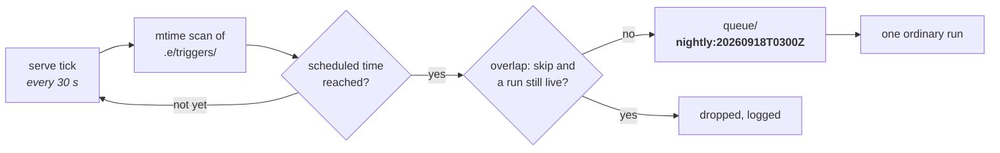

# Tutorial 11: a nightly trigger in `e serve`, under systemd

Goal: declare a cron Trigger, see when it fires next with `e trigger list`,
let a long-lived `e serve` fire it, and keep that `serve` running with a
systemd user unit.

Prerequisite: one working Agent ([Tutorial 1](./01-first-run.md)) and a
repository to work in. The one-shot shape, where CI fires the trigger instead,
is [Tutorial 10](./10-one-shot-triggers.md). The reasoning is in
[ADR-0016](../adr/0016-autonomous-runs.md), section 8.

## How the clock fires a run



The scheduler is one step in `serve`'s existing 30 s tick, so a fire can be up
to 30 s late. The dedup key is the **scheduled** time, so lateness never moves
it.

## Step 1: declare the trigger

In the Store of the repository (`.e/` inside it):

```jsonc
// .e/triggers/nightly/trigger.json
{
  "agent": "pi",
  "prompt": "Nightly sweep {{tick}}: run the linter, fix what it reports, keep the tests green.",
  "on": { "type": "cron", "expr": "0 3 * * *", "tz": "Europe/Berlin" },
}
```

- `expr` is 5 fields or an `@`-alias (`@hourly`, `@daily`, `@weekly`,
  `@monthly`, `@yearly`). There is no seconds field, and `@reboot` is refused.
- `tz` is an IANA zone. Without it the expression runs in **UTC**, not the
  host's zone, so when a trigger fires does not depend on which shell started
  `serve`.
- Only `{{tick}}` and `{{trigger}}` interpolate: a tick has no payload. A
  payload path in `prompt` or `base`, or a `dedup`, is a load error.
- `overlap` defaults to `"skip"`: a tick is dropped while last night's run is
  still going. `"allow"` starts it anyway.

## Step 2: check it before anything fires

```bash
e trigger list
# nightly: cron 0 3 * * * Europe/Berlin -> pi; next 2026-09-19T01:00:00.000Z; last fired unknown (no serve answering for this store)
```

`next` is computed on the spot and needs no `serve`. A bad expression shows
up here as a warning line naming the problem, and in `serve` it disables that
one trigger and nothing else.

`last fired` lives only in a running `serve`'s memory. `e trigger list` asks
the `serve` this Store records in `.e/runs/serve.json` (foreground or
detached); after a restart it reads **unknown**, not never, because the
restart forgot.

## Step 3: let `serve` fire it

```bash
cd /path/to/repo
e serve
```

Every tick rereads a trigger whose files changed, so editing `expr` takes
effect within 30 s without a restart. A changed or new trigger computes its
next fire from now, never retroactively.

`GET /api/triggers` answers the same listing as JSON:

```bash
curl -s http://127.0.0.1:8080/api/triggers | jq '.triggers[] | {id, nextFireAt, lastFiredAt, lastRequestId}'
```

**Missed fires are discarded, never caught up.** A fire noticed up to a
minute late (twice the tick) still happens; later than that, because `serve`
was stopped or the laptop slept over 03:00, nothing fires when it comes back,
and the next fire is tomorrow's. A week of downtime therefore does not flush seven runs into the
queue. Across DST the spring gap has no matching instant (a `30 2 * * *`
trigger does not fire that night) and the autumn hour is not replayed.

A fire that was accepted and then died before its run had a branch - the
queue was full, it waited past the queue TTL, its `base` did not resolve - is a
**dead request**, not lost. List them and start one again, against the trigger
as it is now:

```bash
e trigger dead
# trg-01K... nightly:20260918T0100Z (overflow, 2026-09-18T01:00:02.000Z): the queue is full (50 waiting)
e trigger redrive trg-01K...
```

## Step 4: keep `serve` running

If `serve` is not running, nothing fires and nobody is told. `e` is not a
process supervisor, so hand the supervising to systemd: a user unit around a
**foreground** `e serve` (not `--detached`, which would leave systemd nothing
to watch).

```ini
# ~/.config/systemd/user/e-serve.service
[Unit]
Description=e serve for ~/projects/myrepo
After=network-online.target

[Service]
WorkingDirectory=%h/projects/myrepo
ExecStart=%h/.local/bin/e serve --port 8080
Restart=on-failure
RestartSec=10
# A unit does not read your shell profile: give it the PATH your container
# engine, git and gh live on.
Environment=PATH=%h/.local/bin:/usr/local/bin:/usr/bin:/bin

[Install]
WantedBy=default.target
```

```bash
systemctl --user daemon-reload
systemctl --user enable --now e-serve
loginctl enable-linger "$USER"      # keep it running while you are logged out
journalctl --user -u e-serve -f     # the tick's log: fires, drops, missed fires
```

A restart does not resume a run: on start `serve` checks every run it had by
container name, keeps the ones still running, and marks the rest
`interrupted`.

## What you end up with

- A trigger whose next fire `e trigger list` shows without a server.
- A supervised `serve` firing it at 03:00 Berlin time, keyed
  `nightly:<scheduled time>` in `.e/runs/queue/`.
- Fires that are dropped or missed, each with a line in the journal.
