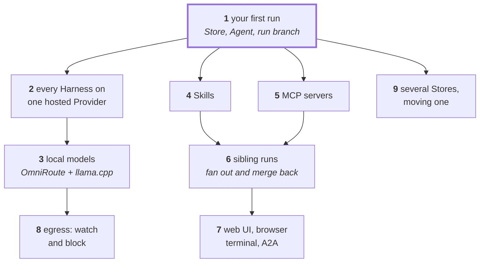

# Tutorials

Hands-on walkthroughs for people using `e`. Each one is self-contained, names
its prerequisites, and ends with something you can inspect. Read them in
order the first time; later they work as recipes.

| #   | Tutorial                                                                       | You end up with                                                                              |
| --- | ------------------------------------------------------------------------------ | -------------------------------------------------------------------------------------------- |
| 1   | [Your first run](./01-first-run.md)                                            | A Store, one Agent on a hosted key, a run branch with an agent's commits                     |
| 2   | [Agents for every Harness on a hosted Provider](./02-hosted-provider.md)       | pi, Claude Code, and Codex Agents on one gateway; the protocol and delivery rules            |
| 3   | [Run agents on local models](./03-local-models.md)                             | The OmniRoute stack with llama.cpp or Ollama, a downloaded model, the default Agents working |
| 4   | [Give an agent a Skill](./04-skills.md)                                        | A hand-written Skill, per run and baked into an Agent                                        |
| 5   | [Wire an MCP server into a run](./05-mcp-servers.md)                           | A container MCP Sidecar and a remote MCP server with a token                                 |
| 6   | [Let an agent fan out into sibling runs](./06-sibling-runs.md)                 | One run delegating to parallel siblings, merged back by the host                             |
| 7   | [The web UI, browser terminal, and `e` as an A2A agent](./07-serve-and-a2a.md) | `e serve`, runs started from the browser, tasks over Agent2Agent, a remote agent             |
| 8   | [Watch and block what agents talk to](./08-egress-blacklist.md)                | The egress log per domain, a blocked domain, and the API behind the Egress page              |
| 9   | [Several Stores, and moving one](./09-stores-export-import.md)                 | A per-project Store next to `~/.e`, and a Store carried to another machine                   |

## The path through them

Start at 1. After that: **2 and 3** are about _where the model comes from_,
**4 and 5** about _what a run can reach_, **6 and 7** about _agents talking to
agents_, and **8 and 9** are operational.

Conventions used throughout:

- A prompt makes a run one-shot: `e spawn <agent> "<prompt>"`. Without a
  prompt the harness TUI opens, which needs a terminal; from a pipe or CI job
  a promptless spawn is refused.
- `~/.e` is the machine Store; replace it with `<project>/.e` when you follow
  [Tutorial 9](./09-stores-export-import.md).
- Vocabulary (Store, Harness, Agent, Provider, Skill, Sidecar, Run) is defined
  in [CONTEXT.md](../../CONTEXT.md); the reasoning behind each mechanism is in
  [docs/adr/](../adr/).

If you are an AI agent inside an `e` run rather than a person at a terminal,
read [docs/agents/e.md](../agents/e.md) instead.
